

# RobotTool User Guide
Version 4.0.0, 15 April 2020

## Introduction
The RobotTool is a tool for detecting (price) changes on webpages.
It is developed by [Statistics Netherlands](https://www.cbs.nl/en-gb) and actively used in the production of price statistics. 
An international version of the RobotTool is maintained in this repository. 

This user guide explains the most important features of the tool.
Suggestions for improvements are always welcome following the guidelines in the [README](../README.md).

### Main window
You start the RobotTool by executing the file ‘robottool.bat’ (on windows) or typing ‘npm start’ in a command window in the RobotTool folder. After the start of the RobotTool a browser window will popup wih the main user interface. This is how it looks after loading the example on collecting data from fake bike shops which is provided in the release of the tool:

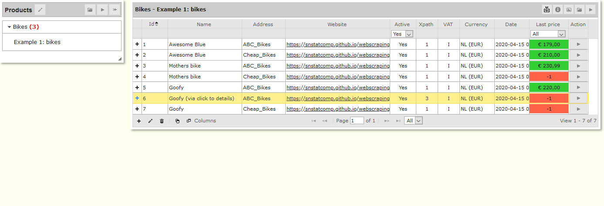

### Product groups and respondents
The RobotTool is designed to monitor the prices of products from web pages of respondents. The left panel shows products organised into product groups.
The red figure between parentheses behind a product group indicates the number of respondents in that product group for whom no price is known yet (in this example 3).

The right panel shows the products to be watched at different respondents for the  product group selected in the left panel. In this particular example there is only one product group, named Bikes. The green and red boxes show the price registered with a product at a respondent. It is green if no change was detected since the previous collection run or if the price analyst approved the price observation. It is red, showing -1, if a change was detected or no price observation could be made.

### Data grid
The RobotTool uses one type of data grid consistently over its user interface, which allows the user to add, edit and delete items, to do pagination and to sort on columns. The screenshots below show these functionalities:

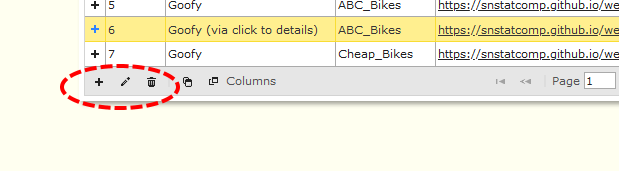

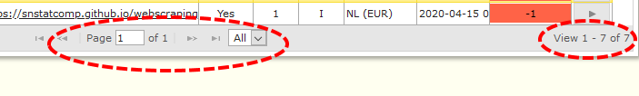

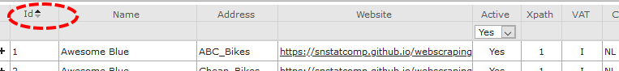

## Product groups
Products groups can be edited by selecting the Edit button on the title of the Left panel. The following window appears:

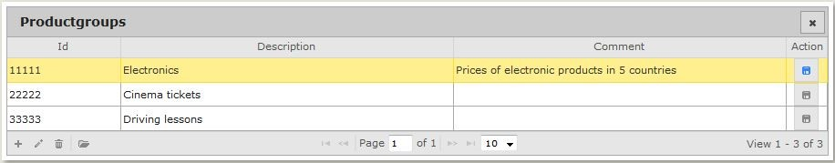

On adding or editing an entry the following window appears:

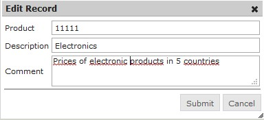

Deleting a product group will issue the following warning:

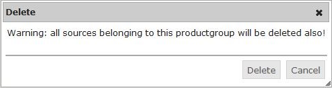

You can *import* a set of product groups (i.e. a product group with its respondents and XPath expressions) by clicking on 

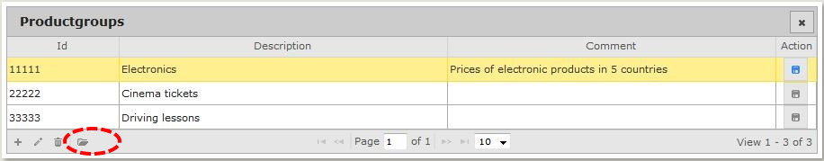

which gives you the following window: 

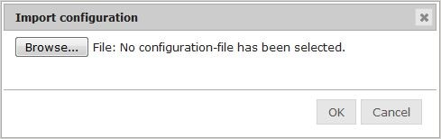

You can select a previously saved configuration file (extension “csv”) by using  “Browse”. 

Note: the Browse button can be used to navigate to a folder on your computer and select a file (extension ‘.csv’), however the path from which the browser tries to read that file from the folder as specified in the configuration file of the RobotTool (see section on Configuration) which is by default the folder ‘ImportExport’ in the RobotTool folder.

You can *export* a configuration of product groups (i.e. a product group with its respondents and XPath expressions) by clicking on the export button in the Action column of the grid.

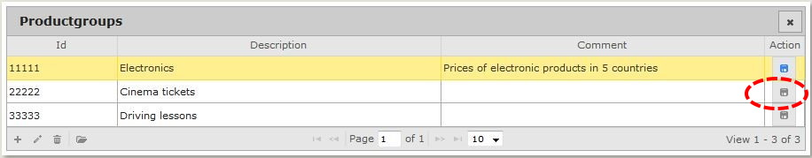

The configuration that is loaded at that particular moment will be saved in a configuration file (.csv) in the Export folder of the RobotTool (see Section ).

## Respondents
The panel on the right in the main user interface is intended for editing the configuration of products to be watched at websites of respondents. This example shows the panel after running the example configuration on fake bike shops produced with the release as an example.

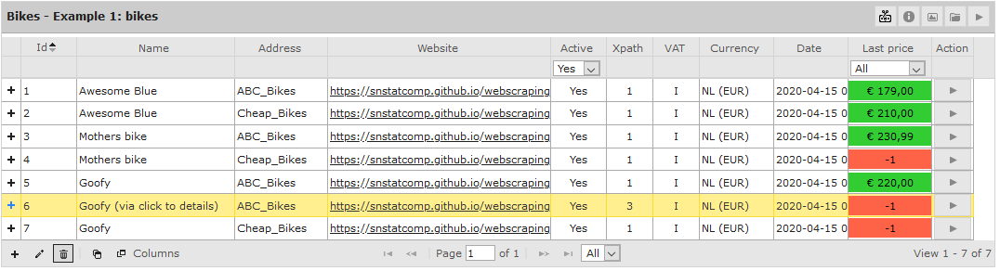

On adding or editing an entry the following window appears:

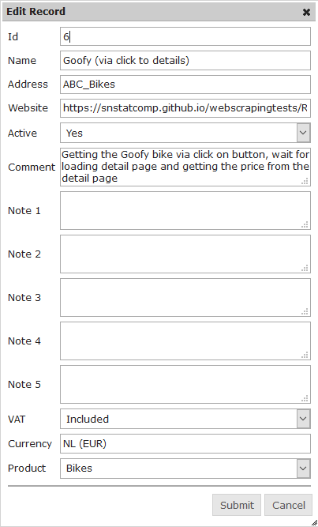

Most fields are easy to understand. The Website field should always be filled with a URL. The RobotTool uses this to start scraping.

The Active field can be used to deactivate respondents from the following scraping run.. Sometimes collecting prices for a respondent becomes impossible after a while (e.g. the respondent has stopped the activities or the prices cannot be retrieved for technical reasons). In those cases it is handy to switch the respondent to inactive (Active = No), still maintaining all configuration and data for this respondent. When inactive, no more prices will be retrieved for this respondent.

Deleting an respondent will issue the following warning:

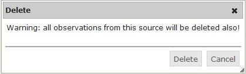

Sometimes it is easy to copy a product-respondent with all the configuration attached, for example when similar products are to be observed from the same or similar web pages. You can copy a product at a respondent using this button:

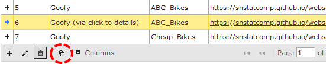

which brings you to a new edit window.

The respondents panel has one more button. This on allows you to select the columns you want to see. After clicking on 

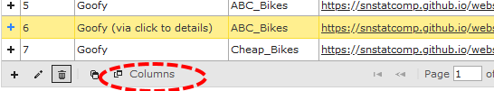

you will arrive at the selection window:

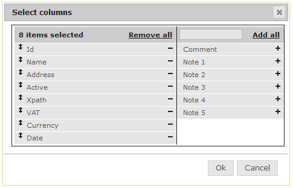

## XPath scraping steps

### Configuring XPaths
Each product respondent item can have one or more scraping steps assigned. We call these scraping steps XPaths for short here because - as explained earlier - they use XPath expressions. 
The Respondents panel is actually a hierarchical panel.
The XPaths for each respondent can be edited in a subpanel which can be reached  by pressing the ‘+’ icon before an entry.
Below is an example showing one step, the retrieval of the part of a webpage specified in the website filed specified by the XPath expression //*[@id='price1'].

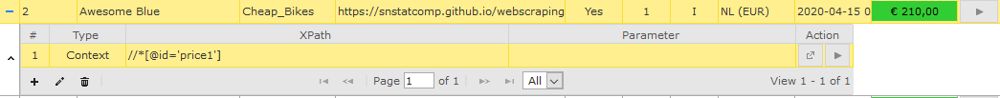

You can add, edit or delete an XPath by clicking on the well known 'add', 'edit' and 'delete' icons in the subpanel. Upon add or edit the following window will appear:

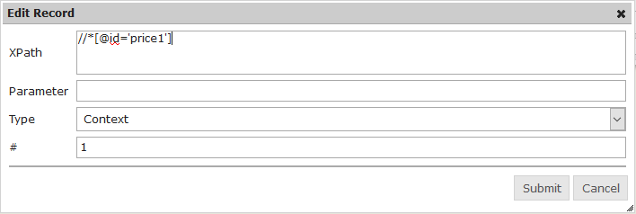

The step number field *#* is automatically generated. It is one up from the largest number of steps existing for this respondent. The step number can be changed but cannot be the same as another step number.

For the *Type* field you can choose from several types of instructions summarised in the table below. All instructions except the *Wait* command need an XPath expression to determine on which part of the web page they work. Some instructions take an additional parameter from the *Parameter* field.

Type|Description|Example
---|---|---
Context|Get the text part of the element specified in the XPath field|XPath: //*[@id='price1'] 
Link|Navigate to the page referred to in the href attribute of the selected element. If the tag of this element is not equal to the *a* tag a click action is performed.| XPath: //*[@id='price1'] | Xpath: Id(‘menu-item’)/a
Input | Insert text into the selected element. This text is taken from the Parameter field. | Xpath: //input[@class=’search’]
Submit | Submit the webform of the selected webform element | 
Screenshot | Take a screenshot of the current webpage and save as HTML and .png. The screenshot will be save in the folder ‘screenshot’ |
Click | Click on the selected element. | XPath: /html/body/div/a
Wait | If the field Xpath is empty the robot waits a number of milliseconds as specified in the Parameter field. If the field Xpath is not empty the robot waits until the selected element is visible by the robot or a timeout occurs. The timeout value (in milliseconds) is taken from the Parameter field. Default: 10000 (10 seconds) | Parameter: 1000
mouseMove | Move the mouse pointer to the selected element. Use this option when an element you are interested in is a part of a popup menu. |
Download | Download the file referred to in the selected element. If the element is an hyperlink (a) then the href attribute is used, if the tag is an image (img) then the src attribute is used. For this file a hash is computed and saved in the context.

The [XPath](https://www.w3.org/TR/1999/REC-xpath-19991116/) language is an international standard.
The average user doesn't need to learn the details of the XPath language to work with the RobotTool.
Most of the expressions needed in daily practice have a specific syntax, for example selecting a price with a specific class name or via the documents hierarchy or via an HTML id.
An even more easy way to get the XPath expressions needed to configure products is to use your browsers' developer tools (usually F12 in your browser) to generate the XPath expression for you.

Some resources that are useful in case you want to learn more about XPath are:
- https://www.w3schools.com/xml/xpath_intro.asp 
- https://devhints.io/xpath
- https://blog.scrapinghub.com/2016/10/27/an-introduction-to-xpath-with-examples
- https://www.tutorialspoint.com/xpath

### Testing XPaths

There are two buttons for testing the XPath expressions, highlighted in the screenshot below:

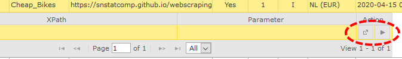

- The button on the left will show you the web page of the respondent after applying all the steps / XPaths up to that particular one. 

- The button on the right will show you the *part of the respondent’s web page* that is the result of applying all steps / XPaths up to the current one. This is called the *price context*. Below are two examples of what you might get, depening on the configuration of the product, the webpage, the XPath expression etc.:

## Data collection and processing

Below you see the right panel of the tool after loading the fake webship example. We loaded some test data whih can be seen in the boxes with red and green background. This panel is also used for data collection and price checking. 

### Starting data collection

By clicking play button in the top right-hand corner (see screenshot below) you can start a data collection run for all products in that panel and retrieve the parts of the web page that were indicated by the list of XPaths for that item. 
We call these part the *price context*.

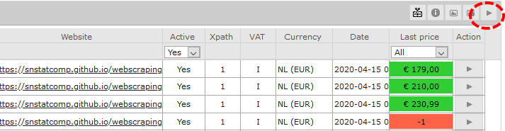

The top right play button of the panel starts a data collection run for all respondents of the product group in that panel and saves the price contexts into the database as a new observations.
This may take some time.
If the run is succeful you get the following message:

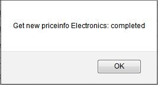

The price contexts are saved into the database together with a timestamp. For each respondent there are two possibilities:
- If data collection was succesful and the price context was *exactly the same* as the last price context stored in the database for that respondent, then the price that was assigned to that last price context is stored in the database and shown in the *Last price* column with a green background.

- If data collection was unsuccesful or the price context was *different* from the last price context stored in the database for that respondent, the value  “-1” is stored in the database and shown in the *Last price* column with a red background. If the collection of the price info failed, an error message with the reason is saved in the price context:

### Checking products with status red

After each data collection the price contexts with a red status need to be checked. 
By clicking on the price or the “-1” in the ‘Last price column’ of the respondents panel one can examine the price, the registered amount and the price context of the observations, up to five of the latest data collection runs. An example is shown below.

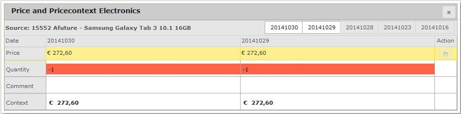

The panel shows by default the two most recent observations. By clicking on the tabs with dates on the top right-hand you can show and hide the other observations so that it is easy to inspect the collection history.

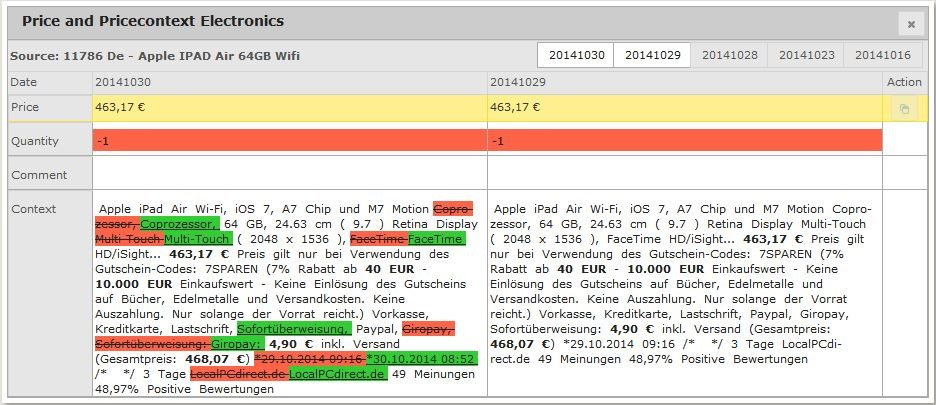

If collecting the price context failed or if the price context has changed, you can adjust the price by editing the field “Price” of the last observation date. You can also edit the Quantity in case of products that sell per quantity. The Comment field allows you to add a remark that should be stored with the observation. All editing can only be done with the most recent observation.

Note: the RobotTool configuration contains a setting that allows you to switch between overwriting observation for the same day or not.

 Apart from adjusting the price (and optionally the quantity) of the last observation by hand as in the previous paragraph, you can also take the price from the previous observation of the respondent. You can do this by clicking on the icon in the Action column. You can only use this when no price has been entered yet (price = -1).

 If the price context of a respondent has changed (e.g. the price is in a different place on the respondent’s website) then you may have to change the XPath expressions. If collecting the price context failed, you can collect the price context of a respondent by clicking on the play icon in the last item of the XPath list of that respondent.

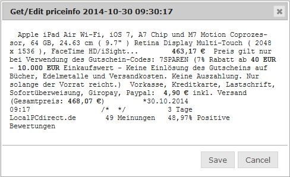

By clicking on “Save” you save the price and price context of the last observation of the respondent in the database, overwriting the old values.

### Exporting prices

The product group panel (the left panel in the main user interface) contains a button name ‘Export prices’  that you can use to export the most recently observed price information of all active respondents. You can selct the product groups to be exported in the following window:

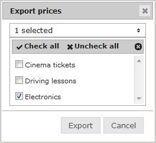

Note: You can select the folder to which prices are saved in the RobotTool configuration (see section on configuration at the end of this document).

On export a CSV file is written to the export folder specified in the RobotTool configuration file (config.json) with the following fields:

- `product group`: Identification of the product group
- `source`: Identification of the respondent
- `observation_date`: Date/time of the observation
- `value`: Observed price
- `quantity`:	Observed quantity
- `comment`: Any comment on the observation
- `context`: Observed price context
- `user_id`: identification string of the user (from the config.json)

## SQLite Database

The RobotTool stores all of its configuration and data in an one-file SQLite database named `observationDB` which is stored in the folder `inst\server\db`.
This allows for easy backup and replacement of the whole database if you like.

Also it is possible to automatie specific tasks you may want to run on this price observation database using your own queries (at your own risk).
If so, we suggest using the following tool:

[sqlitebrowser](https://sqlitebrowser.org/)

## RobotTool configuration
The RobotTool can be configured via the file `config.json`  in the folder:

`inst\app\config`

The configuration setting, defaults and meaning  are:
- `Username` (default: "USER") user identification string, written to the csv on data export
- `Language`: (default "en") default language for user interface
- `Locale`: (default: "nl-NL") default locale used for price currency detection
- `ExportFolder`: (default: "./ImportExport/") Export and import folder for configurations (csv) and data (csv)
- `port`: (default 9033) default port used by user interface
- `Browser`: (default "c:/Program Files/Mozilla Firefox/firefox.exe") default browser to start for user interface
- `Headless`: (default: "firefox") default headless browser to use for scraping, alternative: 'chrome'
- `proxy`: (default: "") set a proxy address if your headless browser needs to go to Internet via a proxy
- `database`: (default: "observationDB.sqlite") default sqlite database to use
- `OneObservationPerDay`: (default: false) If true the tool stores only the last observation in the database per day.
- `proxy_auth`: (default: "") not used
