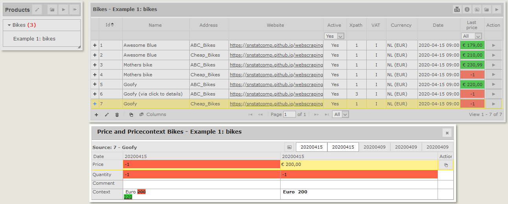

[](http://www.awesomeofficialstatistics.org)

# RobotTool
Tool for detecting (price) changes on webpages by [Statistics Netherlands](https://www.cbs.nl/en-gb).

## Workflow
The RobotTool is an interactive tool for price analysts.

The analyst **defines** a number of **products** and their locations on the web.
During **data collection** the tool checks the products on the websites.
If nothing changed the product status turns green and the last known price for that product is added to the database.
If a change was detected the product status turns red.
The analyst **checks** all **products with status red**:
- If the **price** was **unchanged** the analysts **keeps the price**.
- If the **price** was **changed** the analyst **corrects the price**.
- If the product was not found usually because of a **website change** the analyst **redefines** the **product** configuration.


The analyst typically repeats this proces on a regular basis, per week or month, for example in the proces to compose the HICP.

## Installation
- Install [node.js](https://nodejs.org/en/) and a modern browser (Mozilla Firefox or Google Chrome)
- Download the RobotTool, unzip it, and in the extracted folder run from the command line: 
```bash
  $ npm install
```
## Start
Run from the command line: 
```bash
  $ npm start
```
A webserver will be started and a browser window will pop up.

## Example
The folder `ImportExport` contains an example configuration file `Example_1_bikes.csv`.
You can load this configuration into the RobotTool via the `Edit` -> `Import configuration` button from the products panel.

The example shows several ways to retrieve data from two **fake webshops**:
- [ABC_Bikes](https://snstatcomp.github.io/webscrapingtests/RobotTool/ABC_Bikes)
- [Cheap_Bikes](https://snstatcomp.github.io/webscrapingtests/RobotTool/Cheap_Bikes)

The prices on the Cheap_Bikes webshop are dynamic: some of them change when retrieving the page again. 

When pressing the `Get new priceinfo` button on the right upper corner the tool will collect prices from the fake webshops.
You can then manually initialize the price from the 'price' field in the panel that pops up after pressing one of the red boxes.
After retrieving new data using the `Get new priceinfo` the changes will become visible.

This is a screenshot of the tool after some runs:



## RobotTool user guide
The RobotTool user guide contains a more detailed description of the functionality of the tool, the import and export of configuration and prices, to work with XPaths and how to configure the tool.
It is available in two versions in de `/Doc` folder of this repo:
- [online version](Doc/user_guide.md)
- [pdf version](Doc/user_guide.pdf)
  
In addition there is a *Poster* [pdf](Doc/20200407_RobotTool_Poster.pdf)

## Upgrading
When you upgrade from Robottool version < 4.0.0 you have to upgrade the database.

Run the command:
```bash
  $ npm run-script upgradeDB
```

If you have made some changes in the config file (.\inst\app\config\config.json) apply these changes also to the config file in the new version. Please don’t overwrite the new version of this file with the old version (some new config options were added).

## Limitations / known bugs
- This tool uses a headless version of your browser (usually FireFox). Upon exit of the tool the headless browser process keep running in the background until you explicitly stop it (using the task manager) or restart your computer.

## Suggestions
Questions, suggestions, ideas are welcome: 
- Add an item to the [issue tracker](https://github.com/SNStatComp/RobotTool/issues) issue tracker (you need a GH account).
- Send us a [pull request](https://help.github.com/articles/creating-a-pull-request/) if you have an improvement you think is valuable to all.
- Send an e-mail to `o dot tenbosch at cbs dot nl` or `hjm dot windmeijer at cbs dot nl`.

## License
This tool is provided under an EUPL license on an ‘as is’ basis and without warranties of any kind (see [license file](./LICENSE)).

## Credits
The development of this tool would not have been possible without the active involvement of many price analysts from the price department of Statistics Netherlands.
Early versions of this tool were partly subsidized by a Grant from Eurostat. Older versions are still available at our [research server](http://research.cbs.nl/Projects/RobotTool).
