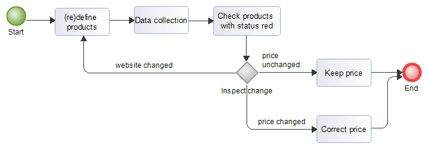

[](http://www.awesomeofficialstatistics.org)

# RobotTool
Tool for detecting (price) changes on webpages by [Statistics Netherlands](https://www.cbs.nl/en-gb).

## Workflow
The RobotTool is an interactive tool for price analysts.

The analyst **defines** a number of **products** and their locations on the web.
During **data collection** the tool checks the products on the websites.
If nothing changed the product status turns green and the last known price for that product is added to the database.
If a change was detected the product status turns red.
The analyst **checks** all **products with status red**:
- If the **price** was **unchanged** the analysts **keeps the price**.
- If the **price** was **changed** the analyst **corrects the price**.
- If the product was not found usually because of a **website change** the analyst **redefines** the **product** configuration.



The analyst typically repeats this proces on a regular basis, per week or month, for example in the proces to compose the HICP.

## Prerequisites
- Node.js (version 8 or higher)
- Google Chrome (version >= 61) or Mozilla Firefox (version >= 56)

## Installation

```bash
  $ npm install
```

## Usage

Start application:
```bash
  $ npm start
```

See the user guide in the documentation map for detailed description of this application.

## Upgrading
When you upgrade from an earlier version of the RobotTool and want to re-use your existing database, copy the file observationDB.sqlite in the folder ‘inst/server/db’ to the same folder in the new version.
When you upgrade from Robottool version < 3 you also have to upgrade the database.

Run the command:
```bash
  $ npm run-script upgradeDB
```

If you have made some changes in the config file (.\inst\app\config\config.json) apply these changes also to the config file in the new version. Please don’t overwrite the new version of this file with the old version (some new config options were added).

## Limitations / known bugs
- If you end the RobotTool without terminating the server process you will get an error if you start it again. The solution is to end the respective node process running in the background.

## Suggestions
Questions, suggestions, ideas are welcome: 
- Add an item to the [issue tracker](https://github.com/SNStatComp/RobotTool/issues) issue tracker (you need a GH account).
- Send us a [pull request](https://help.github.com/articles/creating-a-pull-request/) if you have an improvement you think is valuable to all.

## License
This tool is provided under an EUPL license on an ‘as is’ basis and without warranties of any kind (see license file).

## Credits
The development of this tool would not have been possible without the active involvement of many price analysts from the price department of Statistics Netherlands.
Early versions of this tool were partly subsidized by a Grant from Eurostat. Older versions are still available at our [research server](http://research.cbs.nl/Projects/RobotTool).
